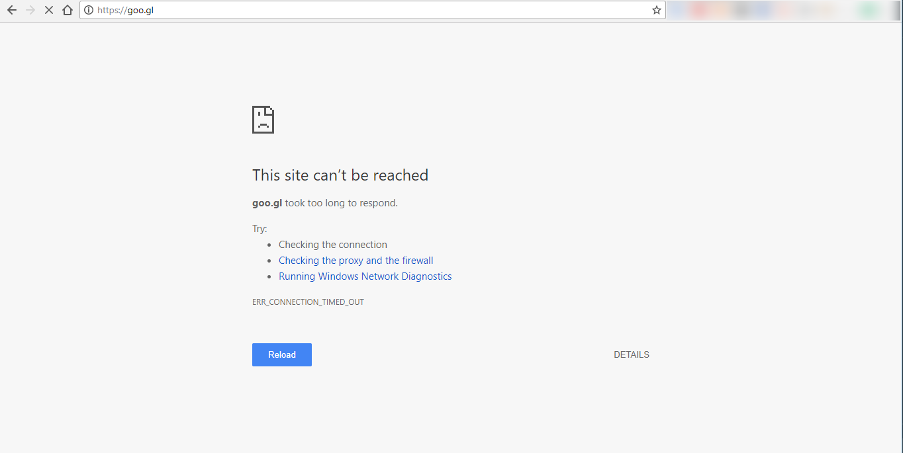

## 说明
1. 这是一个短链接工具。主要用途就是将长链接变成短链接
   - 比如:https://github.com/zkydrx/ShortURLTool 等价于 http://t.cn/Rl2ie1O
2. t.cn是基于新浪的短网址生成的短链接，goo.gl是基于Google的短链接服务。Google 的短网址服务速度非常快，功能很强大
   但是Google的短网址服务必须要翻墙才能使用。新浪的短链接服务器在国内而且稳定。所以目前倾向于使用t.cn这个短网址服务。
3. 由于目前goo.gl无法打开，所以没办法测试GoogleShortUrl的正确性。
